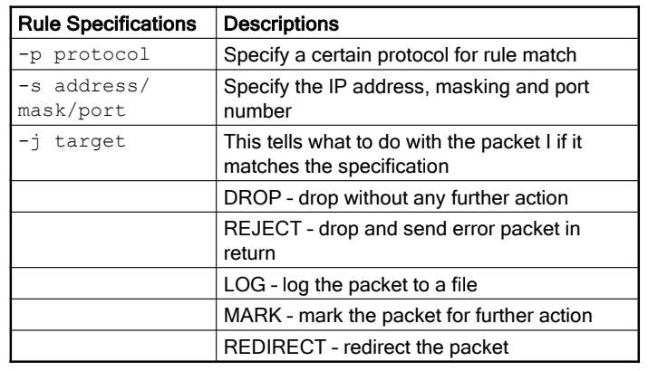

***Lecture 5: PROTECTION/PREVENTION FIREWALL***

## การทบทวนอย่างรวดเร็ว

### กระบวนการด้านความปลอดภัย

- **การประเมินผล**: การประเมินสถานะด้านความปลอดภัยในปัจจุบัน
- **การป้องกัน/การป้องกันล่วงหน้า**: การดำเนินมาตรการเพื่อป้องกันภัยคุกคาม
- **การตรวจจับ**: การตรวจสอบและตอบสนองต่อเหตุการณ์ด้านความปลอดภัย
- **การตอบสนอง**: การจัดการและบรรเทาผลกระทบจากการละเมิดความปลอดภัย

### กระบวนการโจมตีด้านความปลอดภัย

1. **การลาดตระเวน** (Reconnaissance): การรวบรวมข้อมูลเกี่ยวกับเป้าหมาย
2. **การหาประโยชน์** (Exploitation): การใช้ประโยชน์จากช่องโหว่
3. **การเสริมกำลัง** (Reinforcement): การเสริมสร้างตำแหน่งของผู้โจมตี
4. **การรวบรวม** (Consolidation): การรักษาการควบคุมและการเข้าถึง
5. **การปล้น** (Pillage): การดึงข้อมูลหรือทรัพย์สินที่มีค่า

### ปัญหาด้านความปลอดภัยในโปรโตคอลเครือข่าย

- **การโจมตีเฉพาะ**:
  - **การโจมตีปฏิเสธการให้บริการ** (Denial of Service, DoS): การทำให้ระบบไม่สามารถให้บริการได้
  - **การเดาหมายเลขลำดับ** (Sequence Number Guessing): การคาดเดาหมายเลขลำดับในโปรโตคอลการสื่อสารเพื่อดักจับหรือโจมตีเซสชัน

## ขั้นตอนถัดไป

### พิจารณากลไกการป้องกันและการป้องกัน

- **จัดการกับตัวแทนตรงของการโจมตีด้านความปลอดภัย**:
  - ใช้มาตรการเพื่อต่อต้านการลาดตระเวนและการใช้ประโยชน์
- **การโจมตีประสบความสำเร็จได้อย่างไร**:
  - **Oscar** (ผู้โจมตี) ได้รับข้อมูล (การลาดตระเวน)
  - **Oscar** ใช้ประโยชน์จากช่องโหว่
    - ช่องโหว่ที่พบได้ทั่วไปในการออกแบบและข้อบกพร่องในบริการซอฟต์แวร์

### การป้องกันและการป้องกัน

- **หยุด (หรือบล็อก) แพ็กเก็ตที่มีวัตถุประสงค์เพื่อการลาดตระเวนหรือการใช้ประโยชน์**: ป้องกันไม่ให้แพ็กเก็ตที่มีวัตถุประสงค์ในการสอดแนมหรือโจมตีเข้าถึงระบบของคุณ
- **ตรวจสอบและเข้ารหัสการสื่อสาร**: ให้แน่ใจว่าข้อมูลปลอดภัยและไม่สามารถเข้าถึงหรือดักจับได้โดยบุคคลที่ไม่ได้รับอนุญาต

## ไฟร์วอลล์ (Firewall)

### แนวคิดและการทำงาน

- **การเปรียบเทียบทางประวัติศาสตร์**:
  - **ไฟร์วอลล์**: เดิมทีมีวัตถุประสงค์เพื่อป้องกันอาคารที่เสี่ยงต่อการเกิดไฟไหม้ โดยการสร้างกำแพงหนาทึบจากอิฐระหว่างอาคารเพื่อป้องกันไฟไหม้จากการแพร่กระจายไปยังอาคารที่อยู่ใกล้เคียง และลดความเสียหาย
- **ไฟร์วอลล์ในเครือข่าย**: ป้องกันการโจมตีด้านความปลอดภัยจากการแพร่กระจายเข้าสู่เครือข่ายภายในองค์กร

### ไฟร์วอลล์คืออะไร?

- **กลไกควบคุมการเข้าถึงระดับเครือข่าย**:
  - โดยกว้าง ๆ แล้ว ไฟร์วอลล์คือ:
    - **ชุดของฮาร์ดแวร์และซอฟต์แวร์ รวมถึงนโยบายด้านความปลอดภัย**
    - **สิ่งที่วางระหว่างเครือข่ายภายในองค์กร (Intranet) และอินเทอร์เน็ต**: มุ่งหวังที่จะป้องกันการสื่อสารที่ไม่ได้รับอนุญาตและไม่ต้องการจากการเข้าสู่หรือออกจากเครือข่ายภายใน
    - **อนุญาตให้องค์กรสามารถดำเนินการและบังคับใช้นโยบายการไหลของข้อมูลระหว่างอินเทอร์เน็ตและเครือข่ายภายใน** 
  - **ปัจจุบัน หมายถึงหลายสิ่งหลายอย่าง**:
    - ตั้งแต่ **ตัวกรองแพ็กเก็ตที่ง่าย** ไปจนถึง **ระบบป้องกันการบุกรุกที่ซับซ้อน**

    

    - **สร้างการเชื่อมโยงที่ควบคุมระหว่างเครือข่ายสาธารณะที่ไม่ปลอดภัยกับเครือข่ายภายในที่ปลอดภัย**
    - **สร้างกำแพงความปลอดภัยหรือพรมแดนรอบๆ เครือข่าย**
    - ปัจจุบันมี **“ไฟร์วอลล์บนโฮสต์”** ที่ป้องกันไม่ให้เครื่องโฮสต์รับแพ็กเก็ตบางประเภท
    - **แนวคิดของ “พรมแดน” ไม่ถูกต้องอย่างสมบูรณ์ในปัจจุบัน**

## เป้าหมายการออกแบบ

- **การรับส่งข้อมูลทั้งหมดจากภายในเครือข่ายส่วนตัวไปยังภายนอกและกลับจะต้องผ่านไฟร์วอลล์**
- **อนุญาตเฉพาะข้อมูลที่ได้รับอนุญาตตาม “นโยบายความปลอดภัย” ภายในเท่านั้น**
- **ไฟร์วอลล์ต้องป้องกันการถูกเจาะได้มากที่สุด**
  - ลดข้อบกพร่อง, ช่องโหว่, และจุดอ่อนด้านความปลอดภัย
  - ความปลอดภัยของโฮสต์ไม่สามารถขยายได้ดี
    - ระบบปฏิบัติการหลายตัว
    - การควบคุมการเข้าถึงที่ซับซ้อน
    - ช่องโหว่ในซอฟต์แวร์ใหม่
    - การตรวจสอบยาก
  - รันซอฟต์แวร์น้อยกว่ามากเมื่อเปรียบเทียบกับโฮสต์และควบคุมได้ดีขึ้น

## ข้อดีและข้อเสีย

- **ข้อดี**:
  - มีโฮสต์/เครื่อง/อุปกรณ์เพียงหนึ่งเดียวที่ต้องป้องกัน - ไฟร์วอลล์
  - ทำให้การจัดการความปลอดภัยง่ายขึ้น
  - สามารถทำการบันทึกและตรวจสอบที่ละเอียดได้
  - สามารถสร้าง VPN โดยใช้ IPSec กับโฮสต์อื่นๆ
  - ช่วยในการแบ่งส่วนและแยกปัญหา
  - ซ่อนที่อยู่ IP ของสถานีลูกค้าในเครือข่ายภายใน โดยการแสดงที่อยู่ IP เดียวให้กับโลกภายนอก

- **ข้อเสีย**:
  - จุดคอขวด
  - จุดเดียวที่อาจล้มเหลว
  - ความเชื่อมั่นที่ผิดพลาด

## บริการที่ไฟร์วอลล์ให้

- **การควบคุมบริการ**:
  - กำหนดประเภทของบริการที่สามารถอนุญาตให้เข้าออกได้
- **การควบคุมทิศทาง**:
  - กำหนดทิศทางที่บริการสามารถเริ่มต้นและไหลได้
- **การควบคุมผู้ใช้**:
  - กำหนดการเข้าถึงบริการขึ้นอยู่กับผู้ใช้ที่พยายามเข้าถึง (ทั้งเข้ามาและออกไป)
- **การควบคุมพฤติกรรม**:
  - ควบคุมวิธีการที่บางบริการถูกใช้งาน
    - ตัวอย่าง: DNS, การกรองอีเมล เป็นต้น

## การป้องกันด้วยไฟร์วอลล์

- **ป้องกันจาก**:
  - **การขโมยข้อมูล** (Reconnaissance)
    - ตัวอย่าง: ป้องกันการร้องขอและการตอบกลับจากบริการภายในเครือข่ายที่เข้าถึงภายนอก
  - **การทำลายข้อมูล** (Exploitation/Pillage)
    - ตัวอย่าง: ป้องกันการอัปโหลดเนื้อหาที่เป็นลบลงในหน้าเว็บของบริษัทหรือการเปลี่ยนแปลงข้อมูลทางการแพทย์ของพนักงาน
  - **การโจมตีปฏิเสธการให้บริการ** (Pillage)
    - ตัวอย่าง: ป้องกันการโจมตี DoS ทั่วไป เช่น Smurf ต่อโฮสต์ภายใน

## ฟีเจอร์เพิ่มเติมในไฟร์วอลล์

- **ไฟร์วอลล์โซนปลอดภัย (DMZ firewalls)**:
  - พื้นที่ของเครือข่ายที่ได้รับการปกป้องแต่สามารถเข้าถึงได้จากภายนอก
  - เครือข่ายที่เหลือไม่ได้รับการเข้าถึง

- **การกรองเนื้อหา**:
  - ตรวจสอบไม่ให้พนักงานเข้าถึงเนื้อหาบางประเภท เช่น ราคาหุ้น
  - สามารถกำหนดหมวดหมู่ของเนื้อหาที่ไม่ต้องการ
  - สามารถบล็อกเว็บไซต์บางแห่ง

- **การป้องกันไวรัส**:
  - ช่วยในการตรวจจับไวรัส

- **เครือข่ายส่วนตัวเสมือน (VPNs)**

## ข้อจำกัดของไฟร์วอลล์

- **ไม่สามารถป้องกันจาก**:
  - **การโจมตีที่หลีกเลี่ยงไฟร์วอลล์**:
    - การลบไฟล์ทางกายภาพ
    - โมเด็มการโทรจากโฮสต์บนเครือข่ายภายใน
  - **ภัยคุกคามภายในและการโจมตีจากภายใน**:
    - พนักงานที่มีเจตนาร้าย
  - **ไวรัสโดยทั่วไป**:
    - ไวรัสอาจเข้ามาสู่เครือข่ายในหลายวิธี

- **ไฟร์วอลล์ไม่ใช่สิ่งที่สมบูรณ์แบบ**:
  - อนุญาตสิ่งที่คุณอนุญาตให้ทำได้
  - ข้อผิดพลาดของมนุษย์สามารถนำไปสู่การละเมิดความปลอดภัย

## หัวข้อเกี่ยวกับไฟร์วอลล์

- **ประเภทของไฟร์วอลล์**:
  - ตัวกรองแพ็กเก็ต (Packet Filters), ไฟร์วอลล์สถานะ (Stateful Firewalls), ไฟร์วอลล์พร็อกซี (Proxy Firewalls)
    - การแลกเปลี่ยนระหว่างประสิทธิภาพและความปลอดภัย

- **นโยบายไฟร์วอลล์**:
  - การดำเนินการและปัญหาที่อาจเกิดขึ้น

- **สถาปัตยกรรมไฟร์วอลล์**:
  - วางไฟร์วอลล์ไว้ที่ไหน?
  - ฟังก์ชันที่พวกมันจะทำงาน?
  - จะจัดการกับการแยกส่วนของเครือข่ายภายในอย่างไร?

 

# Types of Firewalls
**OPERATION OF PACKET FILTERS AND GATEWAYS**

## ประเภทของไฟร์วอลล์ – ตามฟังก์ชัน

### ประเภทของไฟร์วอลล์

- **ตัวกรองแพ็กเก็ต (Packet Filters)**
- **ไฟร์วอลล์พร็อกซี (Proxy Firewalls)**
  - **ตัวกรองแพ็กเก็ตแบบสถิติ (Static Packet Filters)**
  - **ตัวกรองแพ็กเก็ตแบบไดนามิกหรือสถานะ (Dynamic or Stateful Packet Filters)**
  - **เกตเวย์ระดับวงจร (Circuit Level Gateways)**
  - **เกตเวย์ระดับแอปพลิเคชัน (Application Level Gateways)**

### ตัวกรองแพ็กเก็ต vs. พร็อกซี

- **ตัวกรองแพ็กเก็ต (Packet Filters)**:
  - ตรวจสอบแพ็กเก็ตที่เข้าสู่เครือข่ายทีละแพ็กเก็ต
  - การตรวจสอบแพ็กเก็ตเกี่ยวข้องกับกฎที่ตั้งโดยผู้ดูแลระบบ
  - แพ็กเก็ตสามารถถูกบล็อกไปยังโฮสต์หรือบริการบางตัว (ที่อยู่ IP และพอร์ต)
  - แพ็กเก็ตสามารถถูกบล็อกหากตรงกับโปรโตคอลบางตัว

- **พร็อกซี (Proxies)**:
  - จำลองฟังก์ชันของเลเยอร์แอปพลิเคชัน
  - แยกเครือข่ายที่ได้รับการปกป้องออกจากโลกภายนอก
  - แพ็กเก็ตไม่ได้รับการตรวจสอบทีละแพ็กเก็ต แต่จะถูกถอดรหัสทั้งหมด
    - การตรวจสอบหลังการถอดรหัสจะเผยให้เห็นว่าคำขอนั้นเป็นคำขอที่ถูกต้องหรือไม่

## ประเภทของไฟร์วอลล์ – ตามประเภทอุปกรณ์

- **เราเตอร์ (Routers)**:
  - เราเตอร์ส่วนใหญ่สามารถกำหนดค่าให้ทำหน้าที่เป็นตัวกรองแพ็กเก็ต
  - ง่ายและรวดเร็ว แต่โดยทั่วไปแล้วไม่ค่อยปลอดภัย

- **โฮสต์หลายโฮม (Multi-homed Hosts)**:
  - รันแอปพลิเคชันซอฟต์แวร์บนระบบปฏิบัติการ
  - ช้ากว่าแต่ปลอดภัยกว่า

- **โฮสต์เดียว (Single host)**:
  - ระบบปฏิบัติการใหม่ๆ ส่วนใหญ่มีไฟร์วอลล์ซอฟต์แวร์ในตัวเพื่อปกป้องโฮสต์เดียว

- **อุปกรณ์เฉพาะ (Appliances)**:
  - ฮาร์ดแวร์ ซอฟต์แวร์ และเฟิร์มแวร์ที่ออกแบบมาโดยเฉพาะสำหรับฟังก์ชันไฟร์วอลล์

## ข้อสังเกต

- **“ประเภท” ของไฟร์วอลล์ขึ้นอยู่กับระดับสูงในสแตกโปรโตคอลที่ “แพ็กเก็ต” ถูกตรวจสอบ**:
  - ยิ่งชั้นที่ตรวจสอบสูงมากเท่าไหร่ ประสิทธิภาพก็จะยิ่งแย่ลง
    - ต้องการการประมวลผลมากขึ้นและทำให้การไหลของแพ็กเก็ตช้าลง
  - ยิ่งชั้นที่ตรวจสอบสูงมากเท่าไหร่ เครือข่ายก็จะยิ่งปลอดภัยมากขึ้น
    - ได้รับข้อมูลเพิ่มเติมเกี่ยวกับสิ่งที่แพ็กเก็ตพยายามทำก่อนที่จะอนุญาตหรือยกเลิก

    

- **การพัฒนาเทคโนโลยีได้ลดการเสื่อมสภาพของประสิทธิภาพ แต่ยังคงเป็นปัจจัยที่ต้องพิจารณา**

- **การจัดประเภทไฟร์วอลล์เป็นการฝึกที่มีประโยชน์ แต่ผลิตภัณฑ์จริงอาจทำหลายอย่าง**:
  - ไฟร์วอลล์ส่วนใหญ่มีฟังก์ชันที่ทับซ้อนกัน
    - อาจทำการกรองแบบสถิติและแบบไดนามิกบางอย่าง
    - อาจตรวจสอบเนื้อหาของแอปพลิเคชันบางตัว แต่ไม่จำเป็นต้องทำหน้าที่เป็นพร็อกซี
    - อาจมีทั้งส่วนประกอบซอฟต์แวร์และฮาร์ดแวร์
  - นโยบายของไฟร์วอลล์อาจอยู่ในหมวดหมู่ที่ทับซ้อนกัน

### ตัวกรองแพ็กเก็ตแบบสถิติหรือการกรองแบบ Screening

- **ไฟร์วอลล์ประเภทหนึ่งที่บล็อกหรืออนุญาตแพ็กเก็ตตามที่อยู่ IP หรือหมายเลขพอร์ต**:
  - **Stateless**:
    - ทำงานบนแพ็กเก็ต IP ทีละแพ็กเก็ตที่ชั้นเครือข่าย
  - **ประเภทไฟร์วอลล์ที่เก่าแก่ที่สุด**

- **การอนุญาตหรือไม่อนุญาตแพ็กเก็ตขึ้นอยู่กับ**:
  - กฎชุดหนึ่งที่เข้ารหัสในซอฟต์แวร์ที่รันตัวกรองแพ็กเก็ต
  - การวิเคราะห์ส่วนหัว IP และส่วนหัว TCP/UDP และตรวจสอบ
    - หมายเลขโปรโตคอล, ที่อยู่ IP ต้นทางและปลายทาง, หมายเลขพอร์ต TCP, ธงการเชื่อมต่อ TCP, ICMP เป็นต้น
  - เปรียบเทียบข้อมูลกับกฎในลำดับที่ระบุจนกว่าแพ็กเก็ตจะตรงกับกฎที่ระบุ
    - หากไม่มีการจับคู่กับกฎใดๆ จะดำเนินการตามค่าเริ่มต้น
## การทำงานของตัวกรองแพ็กเก็ตแบบสถิติ

### การกรองแพ็กเก็ต

- เมื่อกรองแพ็กเก็ต การแยกแยะว่าอะไรคือภายนอกและอะไรคือภายในอาจไม่ชัดเจนขึ้นอยู่กับอินเทอร์เฟซ
- ต้องใช้ความระมัดระวังอย่างมากในการตั้งกฎ ดังที่เราจะได้เห็นต่อไป

    

## In and Out...

- แพ็กเก็ตที่เข้ามา "ใน" อินเทอร์เฟซหนึ่งอาจกำลัง "ออก" ไปยังอีกอินเทอร์เฟซหนึ่ง
- รายการควบคุมการเข้าถึง (Access Control Lists) หลายรายการอิงจากการกรองแพ็กเก็ตที่เข้ามาหรือออกจากอินเทอร์เฟซ
- ควรกำหนดกรองแพ็กเก็ตขาเข้าเพื่อหลีกเลี่ยงการประมวลผลเพิ่มเติม

## การกรองแพ็กเก็ต – Cisco IOS

- เราเตอร์ของ Cisco จะเก็บรายการควบคุมการเข้าถึง (ACL)
  - ในการกำหนดค่า ACL ของ Cisco มีคำสั่งที่ดูเหมือนดังนี้:
    - > access-list <number> <criteria>
    - หมายเลขคือตัวระบุประเภทของโปรโตคอล (IP, IPX ฯลฯ)
    - สามารถใช้ชื่อ ACL ที่มีไวยากรณ์:
      - > ip access-list <type> <name>
      - > permit | deny <criteria>
    - สามารถเพิ่มการบันทึกแพ็กเก็ตที่ถูกปฏิเสธ
- มีหลายประเภท – ACL มาตรฐาน, ขยาย, และแบบสะท้อนกลับ (reflexive ACLs)
  - ACL มาตรฐานบล็อกเฉพาะที่อยู่ต้นทางเท่านั้น
    - เร็วกว่าในอุปกรณ์กรองแพ็กเก็ต
  - ACL แบบขยายดูที่หมายเลขพอร์ตและที่อยู่ปลายทาง

## IPchains และ IPtables

- นิยมใช้ใน Linux
  - IPChains ถูกยกเลิกและแทนที่ด้วย IPtables
- IP Chains ยังเก็บรายการว่ามีอะไรบ้างที่ได้รับอนุญาตและไม่อนุญาต
  - > ipchains –A input –i <interface> -p <protocol> -s <source IP address> -d <destination IP address> -l –j DENY/PERMIT
  - พารามิเตอร์ –l หมายความว่าข้อมูลต้องถูกบันทึก
  - พารามิเตอร์ –A หมายความว่าคำสั่งนี้ต้องถูกเพิ่มที่ส่วนท้ายของรายการปัจจุบัน

## กฎสำหรับการกรองแพ็กเก็ต

- ค่าเริ่มต้น:
  - **ทิ้ง (Discard):** ห้ามไม่ให้แพ็กเก็ตใด ๆ ที่ไม่ได้รับอนุญาต
    - เรียกอีกอย่างว่า "นโยบายความปลอดภัยก่อน" (security-first policy)
  - **ส่งต่อ (Forward):** อนุญาตให้แพ็กเก็ตใด ๆ ที่ไม่ได้ห้ามไว้
    - เรียกอีกอย่างว่า "นโยบายความสะดวกในการใช้งานก่อน" (ease-of-use-first policy)

- ตัวอย่าง:
    - นโยบายการทิ้งเริ่มต้น
    -  เป็นการจับคู่สำหรับสิ่งใด ๆ

### กฎนี้ทำอะไร?

- ขั้นแรกจะตรวจสอบว่าแพ็กเก็ตมาจากหรือไปยัง Dracula หรือไม่
- หากใช่แพ็กเก็ตนั้นจะถูกทิ้ง
- ต่อมาจะตรวจสอบว่าโฮสต์ที่ไม่ใช่ Dracula ได้ส่งแพ็กเก็ตไปยังพอร์ต 25 ของเกตเวย์หรือไม่
- หากใช่จะได้รับอนุญาต มิฉะนั้นจะถูกทิ้ง

ไม่มีการกำหนดทิศทางในกฎนี้

### ตัวอย่างต่อเนื่อง

- **พิจารณานโยบาย:** โฮสต์ภายในสามารถส่งอีเมลไปยังภายนอกได้
  - กฎสำหรับสิ่งนี้อาจมีลักษณะดังนี้:
  
- **ปัญหาที่อาจเกิดขึ้นกับกฎนี้?**
  - เราไม่สามารถควบคุมโฮสต์ภายนอกได้ - พวกเขาอาจกำลังรันบริการที่เป็นอันตรายบางอย่างบนพอร์ต 25
  - โฮสต์ภายนอกอาจเชื่อมต่อกับโฮสต์ภายในโดยใช้พอร์ต 25 ซึ่งได้รับอนุญาต!
  - ตัวเลือกที่ดีกว่าคืออนุญาตการโทรออกไปยังพอร์ต 25 ไม่ใช่การโทรทั้งหมด

## การกรองที่อยู่ต้นทาง Source Address Filtering

- มีคำศัพท์ทั่วไปบางคำที่ใช้เพื่อบ่งบอกการกรองแพ็กเก็ตตามที่อยู่ต้นทาง
  - **เครือข่ายที่เป็นมิตร (Friendly Net):**
    - อนุญาตที่อยู่ IP บางอย่างที่มาจากเครือข่ายที่รู้จัก
    - ไม่แนะนำให้ใช้วิธีนี้ - ทำไม?

  - **การกรองขาเข้า (Ingress Filtering):**
    - หมายถึงการกรองที่อินเทอร์เฟซที่อนุญาตให้แพ็กเก็ตจากภายนอกเข้าสู่เครือข่ายภายใน

  - **การกรองขาออก (Egress Filtering):**
    - หมายถึงการกรองที่อินเทอร์เฟซที่ยอมรับแพ็กเก็ตที่ออกจากเครือข่ายภายใน
    - บล็อกที่อยู่ที่ไม่อยู่ในเครือข่ายภายใน (ทำไม?)
    - บล็อกที่อยู่ที่ไม่ได้รับอนุญาตให้เชื่อมต่อกับอินเทอร์เน็ต
    - บันทึกแพ็กเก็ตที่ถูกปฏิเสธทั้งหมด (ทำไม?)

### กฎทั่วไปบางประการ – I: การกรองโดยที่อยู่ต้นทาง

- **ปฏิเสธการเข้าแพ็กเก็ต IP ที่มีที่อยู่ต้นทางบางอย่าง:**
  - ที่อยู่ใดที่เราสามารถปฏิเสธได้โดยไม่ต้องกังวลว่าจะบล็อกการรับส่งข้อมูลที่ถูกต้อง?
    - **ที่อยู่ RFC 1918:** บล็อกที่อยู่เช่น 10.0.0.0 - 10.255.255.255, 172.16.0.0 - 172.31.255.255, 192.168.0.0 - 192.168.255.255
    - **ที่อยู่ Loopback:** 127.0.0.1, ที่อยู่มัลติคาสต์ 224.0.0.0 - 239.255.255.255
    - **ที่อยู่ภายใน**
    - **บางทีที่อยู่ที่มาจากโดเมนบางอย่าง (.in, .ru, .cn)**

- **ปฏิเสธการออกจากเครือข่ายไปยังที่อยู่ IP ที่ควรจะใช้ภายใน**
- **บล็อกที่อยู่ต้นทางบางอย่างชั่วคราวหรือถาวร:**
  - คุณสามารถระบุที่อยู่ IP บางอย่างที่เปิดตัวการโจมตีแบบ DoS
  - มีบางเซิร์ฟเวอร์ IRC ที่คุณไม่ต้องการให้ผู้ใช้ของคุณเชื่อมต่อ
  - โดเมนเช่น login.oscar.aol.com

### การกรองหมายเลขพอร์ตและที่อยู่ปลายทาง

- **อนุญาตการเข้าถึงสำหรับ:**
  - "ช่องทาง" เฉพาะระหว่างเครือข่าย
  - บริการสาธารณะเฉพาะเช่น DNS หรือเว็บ
  - ประเภทแพ็กเก็ตเฉพาะเช่น ICMP MTU violations

- **สามารถกรองแพ็กเก็ตตามหมายเลขพอร์ต, ธงในส่วนหัว, ประเภทโปรโตคอลเฉพาะ:**
  - เพิ่มความละเอียดเพิ่มเติม
  - ทำให้กระบวนการกรองช้าลงเมื่อเทียบกับการกรองเฉพาะที่อยู่ต้นทาง

### กฎทั่วไปบางประการ – II : การกรองโดยที่อยู่ปลายทางและพอร์ต

- **การกรองโดยที่อยู่ปลายทางและพอร์ต:**
  - **Friendly Net:**
    - สามารถเพิ่มความรัดกุมให้กับกฎ Friendly Net โดยระบุหมายเลขพอร์ตและโฮสต์ปลายทางเฉพาะ
    - **ตัวอย่าง:** อนุญาตให้โฮสต์ 130.215.17.13 เข้าถึง 136.142.117.13 หากมีหมายเลขพอร์ตมากกว่า 1023 และกำลังเชื่อมต่อกับหมายเลขพอร์ต 80 เท่านั้น
    - ยังไม่แนะนำโดยไม่ต้องมีการพิสูจน์ตัวตนและการแยกสถาปัตยกรรม

  - **การอนุญาตและไม่อนุญาตประเภทการรับส่งข้อมูลบางประเภท:**
    - คุณสามารถบล็อกประเภทการรับส่งข้อมูลบางประเภทที่ออกจากเครือข่ายของคุณเช่น IRC, การส่งข้อความทันที, Kazaa หรือ ICMP
    - **ตัวอย่าง:** บล็อกคำขอ ICMP echo จากโฮสต์ใด ๆ ไปยังโฮสต์ใด ๆ
      - นี่เป็นความคิดที่ดีหรือไม่? ควรวางทางเลือกที่ไหน?

## ตัวอย่างชุดกฎ (Rule Set)

### ระบุโปรโตคอลและความหมายของกฎ
สมมติว่ากฎนี้ถูกใช้ที่อินเทอร์เฟซของตัวกรองที่ยอมรับแพ็กเก็ตที่เข้ามายังเครือข่าย `136.142.117.y/24`

| กฎที่ | โปรโตคอล | ที่อยู่ต้นทาง (Source Address) | ที่อยู่ปลายทาง (Destination Address) | SRC-Port | DEST-Port | การดำเนินการ (Action) |
|-------|----------|--------------------------------|--------------------------------------|----------|-----------|------------------------|
| 1     | TCP      | 130.215.17.0/24                | 136.142.117.221                      | > 1023   | 22        | อนุญาต (Allow)         |
| 2     | TCP      | ใดๆ (Any)                      | 136.142.117.13                       | > 1023   | 80        | อนุญาต (Allow)         |
| 3     | TCP      | 136.142.117.0/24               | ใดๆ (Any)                            | ใดๆ (Any)| ใดๆ (Any) | ปิดกั้น (Block)        |
| 4     | UDP      | ใดๆ (Any)                      | 136.142.117.13                       | > 1023   | 53        | อนุญาต (Allow)         |
| 5     | UDP      | ใดๆ (Any)                      | 136.142.117.14                       | > 1023   | 53        | อนุญาต (Allow)         |
| 6     | ใดๆ (Any)| ใดๆ (Any)                      | ใดๆ (Any)                            | ใดๆ (Any)| ใดๆ (Any) | ปิดกั้น (Block)        |

---

## ข้อควรจำในการตั้งกฎการกรองแพ็กเก็ต

1. **การทดสอบการจับคู่ที่สมบูรณ์ (Complete match test):**
   - หากส่วนใดส่วนหนึ่งของกฎไม่ตรงกัน แพ็กเก็ตจะถูกย้ายไปยังรายการกฎถัดไป
   - ควรอนุญาตเฉพาะสิ่งที่ต้องการและปฏิเสธสิ่งที่สงสัยแทนที่จะปฏิเสธเฉพาะสิ่งที่สงสัย

2. **กฎเฉพาะควรอยู่ก่อนกฎทั่วไป (Specific rules must precede general rules):**
   - มิฉะนั้น แพ็กเก็ตอาจถูกยอมรับหรือปฏิเสธโดยกฎทั่วไปก่อนที่จะทดสอบกับกฎเฉพาะ
   - ตัวอย่างเช่น ในชุดกฎข้างต้น กฎที่ 6 ไม่สามารถวางไว้ก่อนกฎอื่น ๆ ได้
     - หากวางไว้ก่อนจะเกิดอะไรขึ้น?

3. **การเพิ่มกฎอย่างไม่เป็นระบบอาจทำให้เกิดหายนะ (Adding rules in an ad hoc manner can result in catastrophes):**
   - ต้องใช้ความระมัดระวังอย่างมากเพื่อให้แน่ใจว่ากฎทำงานตามที่ตั้งใจไว้

---

## บริการที่ควรกรอง (Services to Filter)

1. **โปรโตคอลทั่วไป (Common protocols):**
   - **เว็บ (Web):**
     - อนุญาตคำขอ HTTP หรือ HTTPS ขาออก
     - ใช้วิธีการทางสถาปัตยกรรมเพื่อป้องกันเครือข่ายของคุณจากคำขอ HTTP ขาเข้า
   - **FTP:**
     - โปรโตคอลที่ซับซ้อน ต้องการความใส่ใจมากกว่าโปรโตคอลอื่น ๆ
   - **TCP:**
     - ไม่ควรอนุญาตการเชื่อมต่อ TCP ขาเข้ายกเว้นถูกเริ่มต้นจากภายใน
     - ยากที่จะทำด้วยตัวกรองแพ็กเก็ตธรรมดา
   - **NTP:**
     - จำกัดเฉพาะโฮสต์ที่ระบุเท่านั้น
   - **SMTP/เมล (Mail):**
     - ต้องตรวจสอบเพื่อให้แน่ใจว่า "ถูกต้อง"
     - ไม่มีไวรัส, ไม่มีการปลอมแปลงที่อยู่ เป็นต้น
     - ยากที่จะทำด้วยตัวกรองแพ็กเก็ต
   - **POP3/IMAP:**
     - ควรปิดกั้นการเข้าถึงจากภายนอก แต่จะทำให้ผู้ใช้ไม่พอใจ
     - ใช้ SSL tunneling
   - **UDP:**
     - ควรปิดกั้นการโทรทั้งหมด เป็นการป้องกันที่เข้มงวด แต่บางครั้งจำเป็นต้องทำ
   - **อื่นๆ (Others):**
     - ปิดกั้นโปรโตคอลที่ไม่จำเป็นอื่น ๆ เช่น H.323, SMB, Kazaa เป็นต้น

# Personal Firewalls

## Windows XP SP2 Firewall

- **Windows XP SP2** มาพร้อมกับ GUI (ส่วนต่อประสานผู้ใช้แบบกราฟิก) และการควบคุมสำหรับ **Windows Firewall** ของตัวเอง
- เดิมทีรู้จักกันในชื่อ **Internet Connection Firewall**

## Personal Firewalls - II

- **"Desktop firewalls"** เป็นที่นิยมมากขึ้น
  - ปกป้องโฮสต์แต่ละเครื่องจากแพ็กเก็ตที่เป็นอันตราย
  - ทำการกรองแพ็กเก็ตต่อโฮสต์ (per host packet filtering)
- มีผลิตภัณฑ์หลากหลายให้เลือกใช้ เช่น
  - [Zone Alarm](http://www.zonelabs.com)
  - [Tiny Firewall](http://www.tinysoftware.com)
  - [McAfee Personal Firewall Plus](http://us.mcafee.com/default.asp)
  - Symantec, Sygate, Panda Software, Computer Associates และอื่น ๆ

## การกรองแพ็กเก็ต: ข้อดีและข้อเสีย

- การตั้งค่ากฎการกรองแพ็กเก็ตเป็นกระบวนการที่ยากและมีแนวโน้มที่จะเกิดข้อผิดพลาด
  - ลำดับของกฎมีความสำคัญ!
- การกรองแพ็กเก็ตรวดเร็วและเป็นเทคโนโลยีที่มีต้นทุนต่ำ
  - โปร่งใสต่อแอปพลิเคชันของผู้ใช้
- อย่างไรก็ตาม มันไม่ได้ปลอดภัยมากนัก
  - ตัวอย่าง: ตัวกรอง ACL (Access Control List) มาตรฐานที่กรองตามที่อยู่ต้นทาง (source addresses)
    - ที่อยู่ต้นทางสามารถถูกปลอมแปลงได้ง่าย

## การโจมตีตัวกรองแพ็กเก็ต

### การปลอมแปลง IP (IP Spoofing)

- ผู้โจมตีสามารถใช้ที่อยู่ IP ภายในหรือที่อยู่ IP อื่นที่ได้รับอนุญาต
- **มาตรการป้องกัน:**
  - ปฏิเสธที่อยู่ IP ภายในทั้งหมดที่มาจากภายนอก
  - ใช้ **IPSec** สำหรับการยืนยันตัวตน

### การเปิดช่องโหว่ (Opening Holes)

- บางครั้ง เพื่อรองรับโปรโตคอลบางอย่าง ผู้ดูแลระบบจะเปิดช่องโหว่ในชุดกฎ
- ต้องใช้ความระมัดระวังเพื่อจำกัดการเข้าถึงผ่านช่องโหว่เฉพาะโฮสต์จำนวนจำกัด

### ธง ACK (ACK Flags)

- สามารถหลอกลวงตัวกรองแพ็กเก็ตที่ยอมรับแพ็กเก็ตจากเซสชันที่ "ถูกตั้งขึ้น" ซึ่งจริง ๆ แล้วไม่ได้ถูกตั้งขึ้น

## การแยกส่วนของแพ็กเก็ต (Fragmentation)

- การแยกส่วนเกิดขึ้นเมื่อหน่วยการส่งข้อมูลสูงสุด (MTU) ของลิงก์เล็กกว่าขนาดของ IP datagram
  - ตัวอย่าง: ใน Ethernet, MTU คือ 1500 ไบต์
  - ตัวอย่าง: ใน Frame Relay, MTU คือ 1600 ไบต์
- สำหรับเซ็กเมนต์ของ TCP, มีการกำหนดขนาดเซ็กเมนต์สูงสุด (MSS) เช่นกัน
- **Oscar** ใช้การแยกส่วนของ IP datagram เพื่อปกปิดการโจมตี
  - ตัวกรองหลายตัวล้มเหลวในการจดจำแพ็กเก็ตที่ถูกแยกส่วน
  - ระบบตรวจจับการบุกรุก (IDS) บางตัวไม่สนับสนุนการประกอบแพ็กเก็ตใหม่
  - **Oscar** สามารถเจาะเครือข่ายเป้าหมายและเข้าถึงโฮสต์เหยื่อได้
- **การโจมตีด้วยส่วนที่เล็กมาก (Tiny fragment attacks)**
  - การแยกส่วน IP ถูกใช้เพื่อแยกข้อมูลหัวเรื่อง TCP ออกเป็นหลาย IP แพ็กเก็ต
  - RFC 1858 กำหนดวิธีการป้องกันการโจมตีดังกล่าว (ทิ้งส่วนที่มีขนาดเล็กกว่าขนาดที่กำหนด)

## พื้นฐานของการแยกส่วน (Fragmentation Basics)

- เมื่อแพ็กเก็ตถูกแยกส่วน ทุกส่วนจะถึงปลายทาง
- ปลายทางต้องประกอบส่วนที่แยกออกมาใหม่
  - ควรสามารถระบุได้ว่า:
    - ส่วนใดที่เชื่อมโยงกัน
    - ส่วนใดที่ตรงไหน (offset จากจุดเริ่มต้นของแพ็กเก็ต)
    - ส่วนมีข้อมูลเท่าไร (เป็นการตรวจสอบ)
    - มีส่วนเพิ่มเติมหรือไม่ หรือสามารถดำเนินการประกอบใหม่ได้แล้ว
- **IP header** มีข้อมูลที่ใช้ในการประกอบส่วนที่แยกออกมาใหม่
- บางฟิลด์อาจถูกละเว้นได้ยกเว้นในส่วนแรก

### ตัวอย่าง

- **IP datagram** ขนาด 4000 ไบต์มาถึงที่เราเตอร์
  - **MTU** ของลิงก์คือ 1500 ไบต์
  - **IP header** ยาว 20 ไบต์
  - ดังนั้นข้อมูล payload ต้องถูกแยกส่วนและส่งใน **IP datagrams** ใหม่
- ทุก **IP datagram** มีที่อยู่ต้นทางและปลายทาง
  - **Header** ของโปรโตคอล payload จะไม่ถูกทำซ้ำ
  - นี่เป็นสิ่งที่ทำให้ **Oscar** สามารถทำเทคนิคบางอย่างได้

    

### ตัวอย่างที่ 2

- **แต่ละ IP header** มีช่องข้อมูล 16 บิตที่ใช้ในการระบุหมายเลข (identification field):
  - ใช้เพื่อระบุ datagram ที่ส่งโดยโฮสต์
  - ค่านี้จะคงที่ในทุกๆ packet ที่ถูก fragment
  - **Fragment ID** จะถูกตั้งค่าให้ตรงกับค่านี้
- **Fragment IP แรก**:
  - ประกอบด้วย header ของโปรโตคอลที่ใช้งาน (เช่น TCP, ICMP)
  - Offset = 0, ความยาว = 1480 ไบต์
  - ช่องข้อมูล "more fragments" ถูกตั้งค่าเป็น 1
- **Fragment IP ที่สอง**:
  - ประกอบด้วยข้อมูล payload จำนวน 1480 ไบต์
  - Offset = 1480, ความยาว = 1480
  - ช่องข้อมูล "more fragments" ยังคงตั้งค่าเป็น 1
- **Fragment IP ที่สาม**:
  - ประกอบด้วยข้อมูล 1020 ไบต์ และช่องข้อมูล "more fragments" ถูกตั้งค่าเป็น 0

## Fragmentation และ Packet Filters

- **IP header** ของแต่ละ fragment จะบ่งบอกโปรโตคอลของ payload (เช่น TCP, ICMP) แต่ filter มักจะไม่อ่านเนื้อหาในนั้น:
  - Packet filter จำนวนมากเป็นแบบ stateless คือ จะถูกตั้งให้บล็อก packet ที่พอร์ต N จากทุกโฮสต์
  - พวกเขาจะปล่อยให้ fragment เข้ามาในเครือข่ายโดยบล็อกแค่ fragment แรกเท่านั้น
- หลายๆ บริการตั้งค่า **Do not Fragment (DF) flag**:
  - เพื่อค้นหา MTU ที่เล็กที่สุดบนเส้นทาง
  - ข้อความแสดงข้อผิดพลาดของ ICMP จะรายงานว่า IP datagram ไม่สามารถส่งได้เนื่องจาก MTU เล็กกว่าและรายงานค่านี้
- **การทำ Fragmentation แบบเจตนา** ทำให้เกิดการโจมตีหลายๆ แบบ:
  - ตอนนี้สามารถบล็อก packet ที่ถูก fragment ได้ทั้งหมด

## การโจมตีผ่าน Fragmentation

- **nmap** เป็นเครื่องมือสแกนพอร์ตที่ใช้บ่อย:
  - มันสามารถใช้ในการ fragment TCP header ให้กลายเป็น IP datagram หลายๆ ชุด
  - Filter อาจไม่สามารถรู้จักหมายเลขพอร์ตและอนุญาตให้ fragment ทั้งหมดผ่านเข้าเครือข่ายได้
  - **Oscar** สามารถสแกนหาเปิดพอร์ตและบริการได้สำเร็จ
- **ไม่มี fragment สุดท้าย**:
  - มักจะพบใน DoS attack ที่โจมตี router ที่พยายามประกอบ packet เพื่อส่งต่อในลิงค์
- **Overlapping fragments**:
  - **Teardrop** เป็น DoS attack ที่ใช้ overlapping fragments เพื่อทำให้ OS สับสนและล่ม
  - **Ping of death** เป็นการ craft IP packet ที่มี MTU มากกว่า 65535 ทำให้เกิดการล่ม

## โปรโตคอลอื่นๆ ที่อาจผ่าน Packet Filters

- **Tunneling**:
  - การใช้ SSH เพื่อเข้าถึงบริการจะสามารถข้ามการกรองทั้งหมดได้
- **MBone encapsulation**:
  - MBone คือ multicast backbone บนอินเทอร์เน็ต
  - ใช้สำหรับส่งวิดีโอไปยังกลุ่มผู้ชมจำนวนมาก
  - Encapsulates packet ทำให้สามารถข้ามการกรองได้
- **การสร้างพอร์ต Arbitrary**:
  - ซอฟต์แวร์ P2P: BitTorrent, KaZaa, eDonkey เป็นต้น
  - IP โทรศัพท์

## ช่องโหว่ของ Firewall

- เนื่องจากพอร์ต 80 มักเปิดอยู่ ผู้ใช้จำนวนมากจึงใช้พอร์ตนี้ในการ tunneling แอปพลิเคชันอื่นๆ ผ่าน HTTP ด้วยการใช้ SOAP:
  - อ่านที่ http://www.schneier.com/crypto-gram-0006.html
- **Checkpoint’s FireWall-1**:
  - รายงานช่องโหว่ในผลิตภัณฑ์เดือนกรกฎาคม 2000
- **Cisco’s IOS**:
  - มีช่องโหว่ความปลอดภัยในบางเวอร์ชัน
  - **IOS** ถูกใช้งานในผลิตภัณฑ์ของ Cisco ส่วนใหญ่ รวมถึง packet filter และ firewall
  - โค้ดต้นฉบับของ IOS ถูกขโมยและโพสต์บนเว็บโดยวัยรุ่นอายุ 16 ปีจาก Uppsala, สวีเดนในปี 2004
- **Symantec’s Raptor firewall**:
  - **Oscar** สามารถ hijack session ที่ผ่าน firewall ได้

## การกรอง Packet แบบ Dynamic

- **แนวคิด**:
  - สร้าง rulesets แบบ on-the-fly และทำลายมันเมื่อเสร็จสิ้น
- **ตัวอย่าง**:
  - โฮสต์จากเครือข่ายภายใน เช่น 136.142.117.221 เชื่อมต่อกับ telnet server 130.215.17.13 บนเครือข่ายภายนอก
    - หมายเลขพอร์ตที่ client side คือ 1091
    - หมายเลขพอร์ตที่ server คือเท่าไหร่?
  - จะสร้าง ruleset ใหม่ดังนี้:
    - อนุญาตให้ packet จากโฮสต์ 130.215.17.13 พอร์ต 23 ไปยังโฮสต์ 136.142.117.221 พอร์ต 1091
  - Dynamic packet filter จะตรวจสอบ packet ทั้งหมดเพื่อให้แน่ใจว่า SYN, SYNACK และ ACK ถูกเสร็จสิ้น
  - เมื่อสังเกตเห็น packet FIN มันจะทำลาย ruleset ทันทีทำให้การสื่อสารจาก 130.215.17.13 หยุดลง
- ในอุปกรณ์ Cisco สิ่งนี้เรียกว่า “reflexive” access list
- อาจเป็นภาระต่อ router ในแง่ของ performance

## การโจมตี Dynamic Packet Filters

- **ทำได้ยากมาก**:
  - Trojan และ worm ภายในเครือข่ายสามารถใช้ Dynamic filters ในทางที่ผิดได้
- **Oscar ต้องทราบ**:
  - การมีอยู่ของ dynamically created access list
    - การเชื่อมต่อจากโฮสต์ภายในกับโฮสต์ภายนอกจะสร้าง access list ขึ้นมา ไม่มีสิ่งอื่นที่ทำได้
  - เฉพาะโฮสต์ 130.215.17.13 ที่สามารถเชื่อมต่อผ่าน access list นี้ได้
    - **Oscar** จะต้อง spoof ที่อยู่นี้
  - การเชื่อมต่อสามารถทำได้เฉพาะกับโฮสต์ 136.142.117.221
    - **Oscar** ไม่สามารถโจมตีโฮสต์ใดๆ ในเครือข่ายภายในได้
  - การเชื่อมต่อสามารถทำได้เฉพาะกับพอร์ต 1091
  - ขั้นตอน (state) การสื่อสารต้องทราบอย่างแม่นยำ
    - Dynamic packet filters สามารถติดตามลำดับหมายเลขได้
- หาก **Oscar** สามารถทำทั้งหมดนี้ได้ แสดงว่ามีปัญหาด้านความปลอดภัยที่ใหญ่กว่าในเครือข่ายภายใน

## Stateful Firewalls

- **เทคโนโลยี Firewall ที่ทันสมัยและปลอดภัยที่สุด**:
  - เรียกอีกชื่อว่า Stateful Packet Filtering (SPI)
  - ในหลายๆ กรณีเหมือนกับ Dynamic Packet Filtering
- **Firewall** ติดตามคำขอข้อมูลทั้งหมดจาก intranet:
  - สแกนปลายทางของ packet ที่เข้ามาเพื่อตรวจสอบว่าตรงกับแหล่งที่มาของคำขอขาออกก่อนหน้านี้หรือไม่
  - โดยทั่วไปสามารถตรวจสอบหลายเลเยอร์ของ protocol stack ได้
    - ปกติจะอยู่ที่เลเยอร์ 4 และต่ำกว่า แต่บางครั้งอาจถึงเลเยอร์แอปพลิเคชันด้วย
    - ข้อมูลสามารถวิเคราะห์ได้หากจำเป็น
    - การบล็อกสามารถทำได้ที่เลเยอร์หรือความลึกใดๆ
- “State” ของแต่ละ packet ถูกกำหนดและนี่คือเหตุผลที่เรียกว่า “Stateful”

## เพิ่มเติมเกี่ยวกับ Stateful Firewalls

- **Stateful Firewalls** รักษา “State” ในตารางข้อมูล:
  - ช่วยให้พวกเขาสามารถทำให้เกิดระดับความปลอดภัยที่สูงกว่าการกรอง Packet แบบธรรมดา
  - ยังคงสามารถถูกหลอกได้เพราะการเชื่อมต่อบางอย่างที่เข้ามาได้รับอนุญาตแม้ว่าไม่มีการเชื่อมต่อขาออกที่ถูกสร้างขึ้น
- การรักษาข้อมูล State สำหรับ UDP และ ICMP เป็นเรื่องยาก:
  - ไม่มีแนวคิดเรื่อง State สำหรับโปรโตคอลเหล่านี้
  - สำหรับ UDP หมายเลขพอร์ตสำคัญในการรักษาข้อมูล pseudo-state
  - ข้อความ ICMP บางอย่างสามารถมี pseudo-states ได้ (คำขอและการตอบกลับ) แต่การจัดการกับการจราจร ICMP แบบ one way เป็นเรื่องยาก

## เพิ่มเติมเกี่ยวกับ Stateful Firewalls

- **Filter** มักจะดูเฉพาะข้อมูลที่เลเยอร์ 3 และเลเยอร์ 4 บางส่วน:
  - นี่เรียกว่าการกรอง (filtering)
- เป็นไปได้ที่จะตรวจสอบข้อมูลที่เลเยอร์สูงกว่า ลำดับหมายเลข และ payload ด้วย:
  - ตัวอย่าง: สถานะของ HTTP และ FTP สามารถตรวจสอบได้ - สามารถตรวจสอบคำสั่ง GET หรือการแลกเปลี่ยนพอร์ตใน FTP ได้
  - สิ่งนี้เรียกว่า **Stateful Inspection**
- ใน Stateful Firewalls การตรวจสอบที่เลเยอร์แอปพลิเคชันมีเพียงเล็กน้อยและไม่สมบูรณ์:
  - protocol stack ทั้งหมดไม่ได้ถูกนำไปใช้ และเป็นการยากสำหรับ Firewall ในการทำการตรวจสอบอย่างละเอียด
  - มันสามารถทำให้กฎซับซ้อนมาก

## การตรวจสอบในระดับแอปพลิเคชัน

- โดยทั่วไปจะมีการตรวจสอบเพียงบางส่วน:
  - Packet ที่ใช้ในการเริ่มต้น session แอปพลิเคชันจะถูกตรวจสอบ
    - Packet อื่นๆ จะถูกปล่อยให้ผ่านไป
    - Packet ที่เป็นอันตรายที่ตามมาจะไม่ถูกตรวจจับ
  - การตรวจจับดีขึ้นทำให้ยากต่อการโจมตีในลักษณะ stealth
- **Deep Packet Examination**:
  - บางครั้งจำเป็นต้องใช้เพื่อตรวจจับช่องทางลับหรือ payload ที่เป็นอันตรายที่ถูกส่งโดยโปรโตคอลที่รู้จัก
  - ตัวอย่าง: worm หลายตัวใช้ SQL, NetBIOS หรือ HTTP ในการเดินทางบนอินเทอร์เน็ต
  - บางครั้งเรียกว่า IPS-Lite (เพิ่มเติมเมื่อเราพูดถึงการตรวจจับ)

## การกรอง Vs การตรวจสอบ

- **State คืออะไร?**:
  - Protocol, ลำดับหมายเลข, พอร์ต, flags, ack nos., คำสั่งแอปพลิเคชัน (GET, etc.), timeouts, ...
- **เส้นแบ่งที่เบลอ**:
  - การทิ้ง packet โดยใช้ข้อมูล state คือการกรอง?
  - การตรวจสอบ packet โดยใช้ข้อมูล state และข้อมูลแอปพลิเคชันคือการตรวจสอบ?
- **Firewall จัดการและติดตามข้อมูล state อย่างไร?**

## ตัวอย่างของผลิตภัณฑ์ Stateful Firewall

- **Cisco PIX Firewall**
- **Windows Firewall** ถูกกล่าวว่าเป็น Stateful
- **Checkpoint**:
  - ผลิตภัณฑ์ Stateful Firewall แรก
  - **FireWall-1**:
    - ติดตาม UDP โดยใช้ข้อมูล pseudo-state
- **Juniper’s NetScreen Firewall Appliance**
- **Firewall ใหม่ๆ ส่วนใหญ่รองรับ Dynamic Packet Filtering**
- **IPtables และ Netfilter** เป็น software firewall สองตัวที่สามารถใช้งานได้ฟรีสำหรับ Linux

## Proxy Firewalls หรือ Gateways

- ทำหน้าที่เป็นตัวแทนสำหรับทราฟฟิกในระดับแอปพลิเคชันหรือต่ำกว่า:
  - ไคลเอ็นต์ติดต่อ gateway พร้อมกับข้อมูลการระบุ
  - Gateway ติดต่อ server แอปพลิเคชันและส่งผ่าน packet ไปและกลับจากมัน
  - มันทำหน้าที่แทนไคลเอ็นต์และปกป้องแต่ละฝ่ายจากการเชื่อมต่อโดยตรง
- ทำการเชื่อมต่อ TCP สองครั้งแยกกัน:
  - หนึ่งระหว่าง proxy กับโฮสต์ภายนอก
  - อีกหนึ่งระหว่าง proxy กับโฮสต์ภายใน
- Gateway สามารถตั้งค่าให้รองรับเฉพาะบริการและโปรโตคอลบางอย่าง:
  - ตัวอย่างเช่น ไม่อนุญาตให้มี javascript ในหน้า html

## ข้อมูลเพิ่มเติมเกี่ยวกับ Proxy Firewalls

#### Proxy Firewalls: บทบาทและการทำงาน

- **Proxy (พร็อกซี)** ทำหน้าที่เป็นทั้งลูกค้าและเซิร์ฟเวอร์:
  - **ต่อลูกค้าที่เชื่อมต่อกับมัน**: Proxy จะทำตัวเป็นเซิร์ฟเวอร์ โดยรับคำขอและดำเนินการเหมือนกับเป็นปลายทางที่ต้องการ
  - **ต่อเซิร์ฟเวอร์ที่ให้บริการเครือข่าย**: Proxy จะทำตัวเป็นลูกค้า โดยเชื่อมต่อและทำหน้าที่เป็นตัวกลางระหว่างลูกค้าและเซิร์ฟเวอร์
  - **การแยกแยะระหว่างลูกค้าจริงและเซิร์ฟเวอร์**: มักใช้คำว่า “listener” (ตัวฟัง) และ “initiator” (ตัวเริ่มต้น) ของ Proxy เพื่อแยกแยะ

- **Proxy ช่วยปกป้องระบบที่ได้รับการคุ้มครอง**: โดยการซ่อนระบบที่ได้รับการคุ้มครองไม่ให้ถูกมองเห็นจากระบบภายนอก

- **Proxy มักทำงานบนโฮสต์ที่มีการเชื่อมต่อสองทาง**: ซึ่งเรียกว่า **Bastion Host** (บาสตันโฮสต์)

## Bastion Host

- **Bastion (บาสตัน)** หมายถึง ป้อมปราการ
  - **Bastion Host** (บาสตันโฮสต์) เป็นระบบที่คาดว่าจะถูกโจมตี
  - **Bastion Host** เป็นระบบที่มักใช้เป็นแพลตฟอร์มสำหรับ **Proxy Firewall** (พร็อกซีไฟร์วอลล์)
    - ใช้เวอร์ชันของระบบปฏิบัติการที่มีความปลอดภัย
    - ติดตั้งเฉพาะบริการที่จำเป็น
      - เช่น ไม่สามารถติดตั้งเซิร์ฟเวอร์ใหม่ได้
    - ไม่มีบัญชีผู้ใช้บน **Bastion Host**

- **Proxy Modules** (โมดูลพร็อกซี) จะใช้เวอร์ชันที่เรียบง่ายของซอฟต์แวร์
  - ทำให้โค้ดง่ายต่อการวิเคราะห์หาข้อบกพร่อง

- **บริการที่พบได้บน Bastion Host**:
  - **Web** (เว็บ)
  - **FTP** (เอฟทีพี)
  - **E-mail** (อีเมล)
  - **DNS** (ดีเอ็นเอส)

### วิธีการทำงานของ Client กับพร็อกซี

- **วิธีการ SOCKS** (ซ็อคส์)
  - ใช้โปรโตคอลที่อนุญาตให้เพิ่มโมดูลไปยังคล라이เอนต์เพื่อให้รู้จัก **Proxy** (พร็อกซี)
  - คลายเอนต์ส่งคำขอไปที่พร็อกซีแทนที่จะเป็นเซิร์ฟเวอร์จริง

- **ความโปร่งใสของคลายเอนต์** (Client Transparency)
  - โมดูลพร็อกซีจะปลอมตัวเป็นคลายเอนต์และเซิร์ฟเวอร์แบบเรียลไทม์
  - พวกมันจะดักจับแพ็กเก็ต คำขอการเชื่อมต่อ ฯลฯ
  - คลายเอนต์จะถูกหลอกให้คิดว่ามันได้เชื่อมต่อกับเซิร์ฟเวอร์จริง
  - พร็อกซีต้องอยู่ในเส้นทางเครือข่ายระหว่างคลายเอนต์และเซิร์ฟเวอร์จริง

### ประเภทของ Proxy Firewalls

- **Circuit Level Gateway** (เกตเวย์ระดับวงจร)
  - การกรองแพ็กเก็ต ++ ที่ระดับ TCP
  - ตรวจสอบและติดตามเซสชัน (คล้ายกับ **Stateful Packet Filters** (การกรองแพ็กเก็ตตามสถานะ))

- **Application Level Gateway** (เกตเวย์ระดับแอปพลิเคชัน)
  - ซอฟต์แวร์ที่กำหนดเองสำหรับแต่ละบริการที่ตรวจสอบโดยไฟร์วอลล์
  - อนุญาตเฉพาะแพ็กเก็ตที่มีรูปแบบถูกต้องเท่านั้นที่จะผ่านไปได้

## Circuit-level Gateway (CLGW)

- **แนวคิด**:
  - ผู้ใช้ภายในถือว่ามีความเชื่อถือได้ในขณะที่ผู้ใช้ภายนอกไม่เชื่อถือ
  - ตรวจสอบการเชื่อมต่อจากภายในไปยังภายนอกหรือในทางกลับกันว่ามีการอนุญาตหรือไม่
    - ตัวอย่าง: ตรวจสอบว่าหมายเลขลำดับของ SYN และ ACK ถูกต้องหรือไม่
  - การรับส่งข้อมูลทั้งหมดออกไปจะถูกส่งผ่านโดยไม่ต้องตรวจสอบ
  - การรับส่งข้อมูลทั้งหมดที่เข้ามาจะถูกตรวจสอบแต่เพียงเล็กน้อยหรือเช่นเดียวกับกรณีของการกรองแพ็กเก็ต (Packet Filter)

    

### More on Circuit-level Gateways (CLGWs)

#### Pros
- **เร็วกว่า**: CLGWs มักจะเร็วกว่า Application Level Gateways
- **การป้องกัน**: ให้การป้องกันบางส่วนโดยการป้องกันการเชื่อมต่อจาก/ไปยังโฮสต์ภายในบางตัว
- **การป้องกันข้อมูล**: ปกป้องข้อมูลเกี่ยวกับโครงสร้างเครือข่ายภายในและข้อมูลของโฮสต์

#### Cons
- **การตรวจสอบน้อย**: ตรวจสอบแพ็กเก็ตที่ไหลเข้าสู่เครือข่ายเพียงเล็กน้อย
- **โปรโตคอลที่ไม่ใช้ TCP**: ไม่สามารถจำกัดโปรโตคอลที่ไม่ใช้ TCP ได้
- **การตรวจสอบระดับแอปพลิเคชัน**: ไม่ทำการตรวจสอบแพ็กเก็ตในระดับแอปพลิเคชัน

---

### Application-Level Gateway (ALGW)

- **ป้องกันการสื่อสารโดยตรง**: ป้องกันการสื่อสารโดยตรงระหว่างเซิร์ฟเวอร์ภายนอกและคอมพิวเตอร์ภายใน
- **การปรากฏการณ์ของผู้ใช้**: ให้ความรู้สึกแก่ผู้ใช้เหมือนว่าพวกเขากำลังสื่อสารโดยตรงกับเซิร์ฟเวอร์ภายนอก
- **การตรวจสอบคำขอและคำตอบ**: สร้างคำขอและคำตอบของแอปพลิเคชันใหม่และตรวจสอบความถูกต้อง
  - **ตัวอย่าง**: ลูกค้าเข้าถึงเซิร์ฟเวอร์เพื่อดึงหน้าเว็บ
    - เซิร์ฟเวอร์ให้หน้าเว็บพร้อมกับ Java applet ที่เป็นอันตราย
    - ALGW จะลบ applet หลังจากตรวจสอบแล้ว
  - **ตัวอย่าง 2**: FTP ปฏิเสธคำสั่ง "put" เพื่อป้องกันการเขียนลงในเครือข่ายภายใน

## Advantages of Proxy Firewalls

#### Detailed Audit Information
- **การบันทึกที่ละเอียด**: Sys Admins สามารถติดตามการละเมิดนโยบายความปลอดภัยได้อย่างง่ายดาย
- **ประโยชน์จากการบันทึก**: Logs มีความสำคัญอย่างยิ่ง

#### Prevents Information Leakage
- **การป้องกันการรั่วไหลของข้อมูล**: ป้องกันการเปิดเผย IP addresses, ระบบปฏิบัติการที่ทำงาน (ตาม TTL, window size) เป็นต้น

#### Better Than Packet Filters
- **ไม่เสี่ยงต่อ IP Spoofing**: ป้องกันการปลอมแปลง IP
- **การรับรองผู้ใช้**: รองรับการรับรองตัวตนของผู้ใช้
- **กฎการกรองที่เรียบง่าย**: กฎอยู่ภายในแอปพลิเคชันที่ถูกพร็อกซี

## Other Uses

#### Reverse Proxy
- **Proxy แบบย้อนกลับ**: ใช้เมื่อผู้ใช้จากภายนอกเชื่อมต่อกับบริการภายใน
- **การติดตามข้อมูล**: สามารถติดตามว่าใครเข้าถึงข้อมูลใดจากเซิร์ฟเวอร์ของคุณ
- **การรับรองที่ Proxy**: อาจต้องการการรับรองที่ proxy

#### Web Proxies
- **การแคชข้อมูล**: ช่วยให้การตอบสนองเร็วขึ้น

#### Anonymizing Proxies
- **ป้องกันร่องรอยดิจิทัล**: ช่วยป้องกันร่องรอยของกิจกรรม
- **Proxy Chaining**: ใช้ SocksChain เพื่อสร้างการเชื่อมต่อพร็อกซีหลายตัว

## Drawbacks of Proxy Firewalls

#### Single Point of Failure
- **จุดล้มเหลวเดียว**: อาจเป็นจุดเดียวที่ทำให้ระบบล้มเหลว

#### Performance Reduction
- **ลดประสิทธิภาพ**: ลดประสิทธิภาพเนื่องจากการประมวลผลหลายไหลที่โฮสต์เดียว

#### Limited Protocol Support
- **โปรโตคอลไม่ครอบคลุม**: ไม่สนับสนุนโปรโตคอลทั้งหมด

#### Service Limitations
- **บริการที่จำกัด**: บริการที่มีอยู่จำกัด และการปรับให้เหมาะสมกับแอปพลิเคชันใหม่อาจยาก

#### Security Breach Risks
- **ความเสี่ยงจากข้อบกพร่องใน OS**: บั๊กในระบบปฏิบัติการของเกตเวย์อาจทำให้เกิดการละเมิดความปลอดภัย

#### Protocol Issues
- **ปัญหาโปรโตคอล**: โปรโตคอลความปลอดภัย เช่น IPSec อาจไม่เข้ากันกับพร็อกซี ทำให้ VPN แบบ end-to-end เสียหาย

## Proxy Tools

#### FWTK
- **Firewall Toolkit (FWTK)**: พัฒนาโดย Trusted Information Systems (TIS) ผ่านโครงการ DARPA ในปี 1993
- **การพัฒนา**: โค้ดต้นฉบับมีให้ แต่การพัฒนาหยุดแล้ว
- **เอกสาร**: [FWTK Documentation](http://www.fwtk.org/fwtk/docs/)
- **โปรโตคอลใหม่**: ไม่สนับสนุนโปรโตคอลใหม่ๆ เช่น H.323

## SOCKS
- **SOCKS**: เป็นเครื่องมือพร็อกซีที่ใช้กับหลายแอปพลิเคชัน
- **การทำงาน**:
  - **SOCKS Server**: ทำการตรวจสอบการร้องขอ, อนุมัติการร้องขอ, และเชื่อมต่อพร็อกซี
  - **SOCKS Client**: ทำงานบนโฮสต์ภายใน
  - **SOCKS-ified Versions**: มีเวอร์ชันของ Telnet, FTP เป็นต้น

### Versions of SOCKS

#### SOCKS V4
- **ลักษณะ**: ไม่มีการรับรองตัวตนที่แข็งแกร่ง ใช้ TCP headers และ IP addresses เพื่ออนุญาตการเข้าถึง
- **การแก้ไขชื่อโดเมน**: ต้องการให้ลูกค้าแก้ไขชื่อโดเมน

#### SOCKS V5
- **ลักษณะ**: มีการรับรองตัวตนที่แข็งแกร่ง และสามารถทำการแก้ไขชื่อโดเมนได้
- **การสนับสนุน UDP**: รองรับการพร็อกซีสำหรับแอปพลิเคชัน UDP

[รายละเอียดเพิ่มเติม SOCKS](http://www.socks.permeo.com/)

## Remarks

- **ความสำคัญที่ลดลง**: Proxy firewalls กำลังลดความสำคัญลง
  - **เหตุผล**: ปัญหาเกี่ยวกับประสิทธิภาพในเครือข่ายที่มีแบนด์วิดท์สูง และปัญหาเรื่องความเข้ากันได้

## Other Proxy Firewall Software

#### Gauntlet
- **แพลตฟอร์ม**: ใช้ได้ทั้งใน Windows และ UNIX
- **บริการที่รองรับ**: FTP, Telnet, HTTP, NetMeeting, RealAudio, Microsoft SQL เป็นต้น

#### PORTUS

#### Squid
- **ประเภท**: Open source web proxy

## Other Types of Firewalls

#### Cutoff Proxy
- **การทำงาน**: ผสมผสาน CLGW (Circuit-level Gateway) และ packet filters
  - **การเปลี่ยนโหมด**: เริ่มต้นเป็น CLGW และสลับไปเป็น dynamic packet filter
  - **การเชื่อมต่อโดยตรง**: สร้างการเชื่อมต่อโดยตรงระหว่างลูกค้าและเซิร์ฟเวอร์

#### Airgap Proxy
- **การทำงาน**: เขียนข้อมูลที่เชื่อมต่อ "ภายนอก" ลงใน SCSI e-disk จากนั้นอ่านโดยการเชื่อมต่อภายใน
- **ความปลอดภัย**: การเชื่อมต่อโดยตรงถูกตัดออก จึงถือว่าปลอดภัยมากขึ้น

 

# Firewall Architectures
### Firewall Architectures

## สถาปัตยกรรมไฟร์วอลล์

#### การวางตำแหน่งของการกรองแพ็กเก็ตและเกตเวย์
- **การวางตำแหน่ง** ของการกรองแพ็กเก็ต (packet filters) และเกตเวย์ (gateways) สามารถส่งผลต่อความปลอดภัย:
  - ขึ้นอยู่กับการจัดระเบียบเครือข่ายและโปรโตคอล (protocol) ซึ่งอาจทำให้ Oscar ได้รับสิทธิ์บางอย่าง, ไม่มีสิทธิ์เลย หรือสิทธิ์ที่แตกต่างกัน

#### ประเภทของสถาปัตยกรรม
- **Bastion Host (โฮสต์ปราการ)**: ทำหน้าที่เป็น “ปราการ” ปกป้องเครือข่ายส่วนตัวที่เหลือ
  - **Bastion Host** อาจเป็นแบบ single-homed หรือ multi-homed
- **การแยกเครือข่าย**: อาจมีการแยกเครือข่าย (network segments) เพื่อความปลอดภัย

## การกำหนดค่าของไฟร์วอลล์ (1)

#### ไฟร์วอลล์แบบ Screened Host, Single-Homed Bastion

- **การกรองแพ็กเก็ต**: 
  - อนุญาตให้แพ็กเก็ตที่มีที่อยู่เป็นไปยังหรือมาจาก Bastion Host เท่านั้นที่ผ่านได้
- **ระดับความปลอดภัย**: 
  - มีสองระดับของความปลอดภัย
- **ข้อเสีย**:
  - หากการกรองแพ็กเก็ตถูกบุกรุก (compromised) เครือข่ายจะถูกเปิดเผยด้วย

## การกำหนดค่าของไฟร์วอลล์ (2)

#### ไฟร์วอลล์แบบ Screened Host, Dual-Homed Bastion

- **การป้องกัน**:
  - ป้องกันการละเมิดความปลอดภัยเมื่อการกรองแพ็กเก็ตถูกบุกรุก (compromised)
- **ความปลอดภัย**:
  - มีความปลอดภัยมากขึ้น และป้องกันการเชื่อมต่อทางกายภาพโดยตรงระหว่างเครือข่ายภายใน (private network) และโลกภายนอก

### ตัวอย่าง

- **เกตเวย์ใน DMZ**:
  - โลกภายนอกสามารถติดต่อเกตเวย์ (GW) ได้ แต่จะมีข้อจำกัดเนื่องจากการกรองแพ็กเก็ต
- **การเชื่อมต่อที่จำกัด**:
  - การเชื่อมต่อที่จำกัดสามารถทำได้ระหว่าง Net1 หรือ Net2 กับ GW
- **การรับส่งข้อมูล**:
  - ข้อมูลทั้งหมดสามารถผ่านระหว่าง Net1 และ Net2 ได้
  - การโทรออกจาก Net1/Net2 ไปยังโลกภายนอกเป็นไปได้

## การกำหนดค่าไฟร์วอลล์ (3)

- **ไฟร์วอลล์แบบ Screened Subnet**:
  - ใช้ตัวกรองแพ็กเก็ตสองตัว
  - สร้างเครือข่ายย่อยที่แยกออกซึ่งมีบาสตันโฮสต์ (Bastion Host) และการเชื่อมต่อที่ไม่ปลอดภัยอื่น ๆ
  - มีการป้องกันสามระดับ และเครือข่ายภายในจะไม่สามารถมองเห็นจากโลกภายนอก
  - โลกภายนอกจะไม่สามารถมองเห็นเครือข่ายภายใน

## ตัวอย่าง - FTP

**การดำเนินการ**:
- **ลูกค้า (ผู้ใช้)** จะเปิดช่องทางควบคุม (control channel) ไปยังเซิร์ฟเวอร์
- เพื่อตั้งค่าการเชื่อมต่อข้อมูล (data connection) มีสองตัวเลือก:

  - **PORT**:
    - ลูกค้าส่งคำสั่ง PORT ผ่านช่องทางควบคุม
    - คำสั่งนี้ประกอบด้วยที่อยู่ IP (อาจจะแตกต่าง) และหมายเลขพอร์ตแบบสุ่มของลูกค้า
    - เซิร์ฟเวอร์ FTP เชื่อมต่อจากพอร์ต 20 ไปยังพอร์ตสุ่มที่ลูกค้า

  - **PASV - ตัวเลือก Passive**:

## รายละเอียดเพิ่มเติมของ PORT

## ตัวอย่าง - FTP 2

**PASV**:
- ลูกค้าส่งคำสั่ง PASV
- เซิร์ฟเวอร์เริ่มฟังที่พอร์ตสุ่มและแจ้งให้ลูกค้าทราบในคำตอบ
- ลูกค้าเริ่มต้นช่องทางข้อมูล (data channel)
  - อาจเป็นที่อยู่ IP และหมายเลขพอร์ตใหม่ใด ๆ

## ผลกระทบต่อไฟร์วอลล์

#### Packet Filter
- หากการเชื่อมต่อ TCP ทั้งหมด (SYN) ที่พอร์ตสุ่มถูกปิด FTP จะไม่ทำงานกับ PORT แต่จะทำงานกับ PASV
- ผลกระทบที่คล้ายกันกับการกรองแพ็กเก็ตแบบไดนามิก

#### Stateful Firewalls
- ด้วยการตรวจสอบแพ็กเก็ตเชิงลึก (deep packet inspection) อาจอนุญาตให้ FTP ดำเนินการต่อได้

#### Proxy Firewalls
- ต้องตระหนักถึงสองช่องทางและทำตัวให้เหมาะสม

## การโจมตีที่อาจเกิดขึ้นจากการใช้ FTP - 1

- เซิร์ฟเวอร์ FTP อนุญาตการเชื่อมต่อแบบไม่ระบุตัวตน (anonymous)
- เซิร์ฟเวอร์เว็บยังรัน Telnet สำหรับผู้ดูแลระบบ
- ไฟร์วอลล์แบบ stateful บล็อกการเชื่อมต่อขาเข้าทั้งหมด ยกเว้นการเชื่อมต่อที่พอร์ต 21 บนเซิร์ฟเวอร์ FTP และพอร์ต 80 บนเซิร์ฟเวอร์เว็บ
  - ดูเหมือนว่าเราจะได้รับการปกป้องหากบริการ Telnet มีช่องโหว่

## การโจมตีที่อาจเกิดขึ้นจากการใช้ FTP - 2

- ออสการ์ทำอย่างไร?
  - ใช้การเชื่อมต่อ FTP ที่ถูกต้องเพื่ออัปโหลดไฟล์ไปยังเซิร์ฟเวอร์ FTP
    - ไฟล์นี้มีคำสั่งการโจมตี Telnet
  - ใช้ช่องทางควบคุม (control channel) ตั้งค่า IP address และหมายเลขพอร์ตสำหรับการถ่ายโอนข้อมูลเป็น 136.142.117.132 และ 23
  - ใช้ช่องทางคำสั่ง (command channel) และคำสั่ง “RETR” เพื่อดึงไฟล์ที่เป็นอันตราย
  - ไฟล์ที่เป็นอันตรายถูกส่งไปยังเซิร์ฟเวอร์เว็บที่พอร์ต 23!
  
- วิธีการแก้ไข
  - อนุญาตการอัปโหลดไปยังเซิร์ฟเวอร์ FTP แต่ไม่อนุญาตการดาวน์โหลดจาก FTP ไปยังเซิร์ฟเวอร์อื่น
  - ใช้ไฟร์วอลล์แบบพร็อกซี่
    - พร็อกซี่สามารถตรวจสอบว่า IP address ในคำสั่งพอร์ตเป็น IP address ภายในและบล็อกการถ่ายโอนได้

## DNS และไฟร์วอลล์

- การดำเนินการ DNS ในโทโพโลยี DMZ
  - ป้องกันไม่ให้ผู้ใช้ภายนอกเข้าถึงชื่อ/ที่อยู่ของโฮสต์ภายใน
  - ยังอนุญาตให้ผู้ใช้ภายในติดต่อกับโลกภายนอกได้

## DNS และไฟร์วอลล์ - 2

## การเลือกไฟร์วอลล์

#### 1. ไฟร์วอลล์ที่ใช้เราเตอร์/เฟิร์มแวร์
- เพิ่มส่วนประกอบเพิ่มเติมในเราเตอร์เพื่อให้สามารถทำงานเป็นไฟร์วอลล์ได้
- มีราคาแพงและบางครั้งอาจทำให้เราเตอร์ทำงานหนักเกินไป

#### 2. ไฟร์วอลล์ที่ใช้ซอฟต์แวร์
- มีความซับซ้อนสูง
- รันบนโฮสต์ที่ใช้ UNIX/Linux หรือ WinNT แบบเฉพาะ
- ต้องการการบำรุงรักษาและการสนับสนุนอย่างต่อเนื่อง เช่น การอัปเดตแพตช์

#### 3. อุปกรณ์ไฟร์วอลล์เฉพาะทาง
- ประสิทธิภาพสูง
- การติดตั้งแบบ Plug-and-play

## นโยบายไฟร์วอลล์

#### นโยบายทั่วไป
- ปฏิเสธทุกอย่างนอกจากที่ได้รับอนุญาตอย่างชัดเจน
  - หรือสิ่งที่เข้ามาในเครือข่ายอยู่ดี :-(
- ความซับซ้อนของนโยบายอาจทำให้ไม่สามารถบังคับใช้งานได้และไม่สอดคล้อง
  - หากนโยบายไม่สามารถบังคับใช้งานได้ ผู้คนจะละเลยกฎ
  - ตัวอย่าง: รายงานการโจมตีไวรัส - ผู้คนทำความสะอาดไวรัสและไปต่อ
- ต้องมีเครื่องมือที่สามารถรวบรวมข้อมูลที่เกี่ยวข้องกับ "ต้อง" ในการนโยบาย

#### การสร้างนโยบายทั่วทั้งองค์กรเป็นสิ่งสำคัญ
- ต้องระบุความเสี่ยง, อัปเดตนโยบาย, กำหนดนโยบายสำหรับพนักงานที่เคลื่อนที่ และต้องใช้ความระมัดระวังอย่างยิ่ง

## ตัวอย่างของ iptables ไฟร์วอลล์

## ตัวอย่างของแพ็กเก็ต TCP/IP

- **OSI Model**  
- **Sample of TCP/IP Data Packet**

| Protocol | Contents      | OSI Layer  |
|----------|---------------|------------|
| Ethernet | MAC address   | Datalink   |
| IP       | IP address    | Network    |
| TCP      | TCP header    | Transport  |
| HTTP     | HTTP header   | Application|
| Application Data | Web page Data | Business Process |

## กระบวนการทางธุรกิจด้านความปลอดภัย

#### 1. พัฒนานโยบายการใช้เครือข่าย
- กำหนดข้อกำหนดการใช้เครือข่ายสำหรับองค์กร

#### 2. แผนที่บริการที่ต้องการทั้งภายนอกและภายใน
- ระบุและจัดทำรายการบริการที่จำเป็นสำหรับการเชื่อมต่อภายนอกและภายใน

#### 3. แปลงนโยบายการใช้เครือข่ายและบริการที่ต้องการเป็นกฎไฟร์วอลล์
- เปลี่ยนนโยบายการใช้เครือข่ายและบริการที่ต้องการให้เป็นกฎที่ใช้กับไฟร์วอลล์

#### 4. ดำเนินการและทดสอบฟังก์ชันและความปลอดภัย
- ติดตั้งและทดสอบการทำงานและความปลอดภัยของกฎไฟร์วอลล์

#### 5. ทบทวนและทดสอบกฎไฟร์วอลล์ของคุณเป็นระยะ
- ตรวจสอบและทดสอบกฎไฟร์วอลล์เป็นระยะเพื่อให้มั่นใจในความสอดคล้องและประสิทธิภาพ

## iptables
**iptable** เป็นไฟร์วอลล์โอเพนซอร์สสำหรับ Linux

- เว็บไซต์: [www.netfilter.org](http://www.netfilter.org)
- ยังสามารถใช้เป็นโมดูลสำหรับซอฟต์แวร์บริหารจัดการ Linux หลายๆ ตัว

#### ตารางพื้นฐานสำหรับชุดกฎ

- **input**: กฎที่ใช้กับแพ็กเก็ตที่เข้ามายังเครื่อง
- **forward**: กฎที่ใช้กับแพ็กเก็ตที่ผ่านเครื่องไปยังเครือข่ายอื่น
- **prerouting**: กฎที่ใช้กับแพ็กเก็ตก่อนที่จะถูกส่งถึงเครือข่ายภายใน
- **postrouting**: กฎที่ใช้กับแพ็กเก็ตหลังจากที่ถูกส่งออกจากเครือข่ายภายใน
- **output**: กฎที่ใช้กับแพ็กเก็ตที่ออกจากเครื่อง

## การใช้คำสั่งในบรรทัดคำสั่ง

| Command                | Description                                      |
|------------------------|--------------------------------------------------|
| **-A chain**           | เพิ่มกฎหนึ่งหรือมากกว่าใน chain ที่ระบุ         |
| **-I chain rulenum**   | แทรก chain ที่ตำแหน่งหมายเลขที่ระบุ              |
| **-D chain**           | ลบ chain ที่ระบุ                                |
| **-L**                 | แสดงรายการกฎทั้งหมด                            |
| **-F**                 | ล้างกฎทั้งหมดใน chain ปัจจุบัน                 |
| **-P chain policy**    | ตั้งนโยบายสำหรับ chain ที่ระบุ                  |

#### ตัวอย่างของการกำหนดกฎ

## ขั้นตอนการสร้างไฟร์วอลล์ iptables

1. **สมมุติว่าช่วง IP ของ LAN ภายในคือ 192.168.0.1 - 192.168.0.254**
   - การเชื่อมต่อ eth1 คือการเชื่อมต่อ LAN ภายใน
   - การเชื่อมต่อ eth0 คือการเชื่อมต่อ Internet หรือ WAN

2. เริ่มต้นโดยการลบกฎที่มีอยู่ทั้งหมดด้วยคำสั่ง Flush:
   - `iptables -F FORWARD`
   - ล้างเครือข่ายอื่น ๆ:
     - `iptables -F INPUT`
     - `iptables -F OUTPUT`

3. ตั้งค่าสำหรับการปฏิเสธทั้งหมด:
   - `iptables -P FORWARD DROP`
   - `iptables -A INPUT -i eth0 -j DROP`

4. อนุญาตให้แพ็กเก็ตที่แบ่งส่วนได้:
   - `iptables -A FORWARD -f -j ACCEPT`

5. ป้องกันการโจมตีแบบ spoofing และ smurf:
   - `iptables -A FORWARD -s 192.168.0.0/24 -I eth0 -j DROP`
   - `iptables -A FORWARD -p icmp --i eth0 --d 192.168.0.0/24 --j DENY`

6. อนุญาตเฉพาะการเชื่อมต่อที่เริ่มต้นจากภายใน:
   - `iptables -A FORWARD -p tcp -i eth0 --d 192.168.0.0/24 --dports www,smtp --tcp-flags SYN,ACK -j ACCEPT`
   - `iptables -A FORWARD -p tcp -i eth0 --d 192.168.0.0/24 --sports www,smtp --tcp-flags SYN,ACK -j ACCEPT`

7. อนุญาตการเชื่อมต่อที่เข้ามาจากภายนอกเพียงบางพอร์ต:
   - `iptables -A FORWARD -m multiport -p tcp -i eth0 --d 192.168.0.0/24 --dports smtp --syn -j ACCEPT`

8. อนุญาตการเชื่อมต่อที่ออกไปที่ผู้ใช้เริ่มต้น แต่เพียงบางโปรโตคอล:
   - `iptables -A FORWARD -m multiport -p tcp -i eth0 --d 0.0.0.0 --dports www,smtp --syn -j ACCEPT`

9. อนุญาตบาง UDP แพ็กเก็ตที่เข้ามา:
   - `iptables -A FORWARD -m multiport -p udp -i eth0 --d 192.168.0.0/24 --dports domain -j ACCEPT`
   - `iptables -A FORWARD -m multiport -p udp -i eth0 --s 192.168.0.0/24 --sports domain -j ACCEPT`

10. อนุญาต ICMP ทุกประเภทภายในออกไป แต่เพียงบางประเภท เช่น echo-reply เข้ามา:
    - `iptables -A FORWARD -m multiport -p icmp -i eth0 --d 192.168.0.0/24 --dports 0,3,11 -j ACCEPT`
    - `iptables -A FORWARD -m multiport -p icmp -i eth1 --d 0.0.0.0 --dports 8,3,11 -j ACCEPT`

11. ตั้งค่าการบันทึก:
    - `iptables -A FORWARD -m tcp -p tcp -j LOG`
    - `iptables -A FORWARD -m udp -p udp -j LOG`
    - `iptables -A FORWARD -m udp -p icmp -j LOG`
